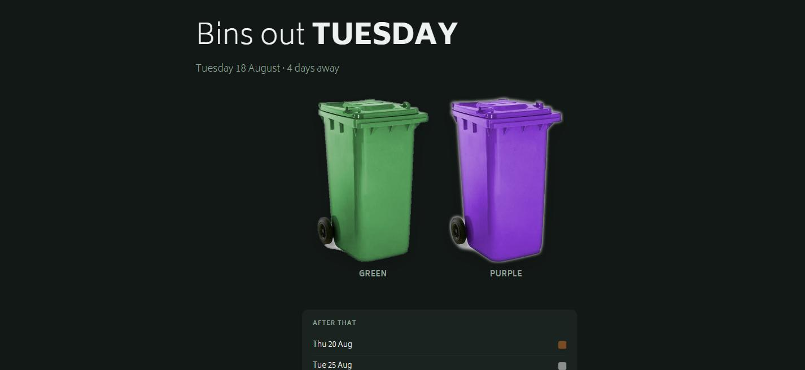

# binday

Unofficial clients for Angus Council bin collection dates — a Python CLI and a
self-hosted PHP web page.

Angus Council doesn't publish an API for bin collections — the only way to get your
dates is the [MyAngus bin collection form](https://myangus.angus.gov.uk/service/Bin_collection_dates_V3),
which is a JavaScript-rendered Granicus/Firmstep AchieveForms page. This project
talks to the endpoints behind that form directly.

No account, API key, or authentication is required. The session token endpoint is public.

## What's here

| File | What it does |
|---|---|
| `index.php` | Responsive web page showing the next collection and its bin colours |
| `angus_bins.py` | Command-line client for looking up addresses and dates |
| `img/bin_*.png` | Bin images — grey, green, purple, blue, brown |

---

# Web page (PHP)

A single-file page for a cPanel host, wall display, or spare tablet. Reads live
from the API and caches to a JSON file — no database, no cron job.



### Deploy

Upload `index.php` and the `img/` folder to your web root. Requires **PHP 7.0+**;
cURL is used if available, with a stream-wrapper fallback if not.

Set your UPRN at the top of the file:

```php
const UPRN       = '117060380';   // find yours with angus_bins.py --postcode
const CACHE_TTL  = 6 * 60 * 60;   // how long to trust cached data
const TIMEZONE   = 'Europe/London';
const REFRESH    = 3600;          // browser auto-refresh, 0 to disable
const IMG_DIR    = 'img';
```

The page writes `.binday-cache.json` next to itself, so that directory needs to be
writable. If it isn't, everything still works — you just hit the API on every load.

### Behaviour

- Headline reads `TODAY`, `TOMORROW`, or the weekday name
- Shows every bin due on the next collection date, then the following three dates
  as coloured chips
- Falls back to stale cache if Angus is unreachable, rather than showing an empty page
- Empty API responses are never cached, so a bad response can't wedge the page
- Fluid type and image sizing via `clamp()`; respects `prefers-color-scheme: dark`

---

# Command line (Python)

## Install

```bash
pip install requests
```

## Usage

Find your UPRN from a postcode:

```bash
$ python angus_bins.py --postcode "DD9 7AJ"
   117091748  1 PARK GROVE BRECHIN DD9 7AJ
   117060376  2 PARK GROVE BRECHIN DD9 7AJ
   117060380  7 PARK GROVE BRECHIN DD9 7AJ
   ...
```

Then look up collections:

```bash
$ python angus_bins.py --uprn 117060380
2026-08-18  Green    (every 2 weeks)
2026-08-18  Purple   (every 2 weeks)
2026-08-20  Brown    (weekly)
2026-08-25  Grey     (every 4 weeks)
2026-09-08  Blue     (every 4 weeks)
```

Or do both in one go:

```bash
python angus_bins.py --postcode "DD9 7AJ" --house 7
```

### Options

| Flag | Description |
|---|---|
| `--postcode` | Postcode or partial address to search |
| `--house` | House/flat number, auto-picks from the search results |
| `--uprn` | UPRN, skips the address search entirely |
| `--date` | Start date as `YYYY-MM-DD` (default: today) |
| `--json` | Emit raw JSON instead of a table |

Once you know your UPRN, hardcode it — it never changes.

---

# The API

Three calls against `https://myangus.angus.gov.uk`. Everything is a `POST` to
`/apibroker/runLookup` with a lookup ID identifying which query to run.

> **Cookies are mandatory.** The auth call sets a session cookie that the lookups
> require back. Sending the `sid` parameter without it returns `HTTP 200` with an
> empty `rows_data` — success-shaped, but no data. Use a session/cookie jar
> (`requests.Session`, `CURLOPT_COOKIEJAR`) for all three calls.

### 1. Get a session token

```http
GET /authapi/isauthenticated?uri=https://myangus.angus.gov.uk/AchieveForms/
    &hostname=myangus.angus.gov.uk&withCredentials=true
```

```json
{ "auth-session": "b4c366e64c0db72b97e24984c289861a", "is_authenticated": false }
```

Take `auth-session` and pass it as the `sid` query parameter on every subsequent
call — and keep the cookie the response set.

### 2. Search addresses — lookup `65a5507c8d3e6`

```http
POST /apibroker/runLookup?id=65a5507c8d3e6&app_name=AF-Renderer::Self&sid=<sid>
Content-Type: application/json

{"formValues": {"Section 3": {"formatted_search": {"value": "DD9 7AJ"}}}}
```

Returns one row per address in `integration.transformed.rows_data`, keyed by index:

```json
{
  "display":  "7 PARK GROVE BRECHIN DD9 7AJ",
  "UPRN":     "117060380",
  "flat": "7", "house": "", "street": "PARK GROVE",
  "town": "BRECHIN", "postcode": "DD9 7AJ", "locality": "",
  "lacode": "9053", "usrn": "700747",
  "easting": "360604", "northing": "760330",
  "lat": "56.732951254235", "lng": "-2.6455122286955"
}
```

The same data is also returned as `select_data` (`{label, value}` pairs) for
dropdown binding.

### 3. Get collection dates — lookup `66587d491feab`

```http
POST /apibroker/runLookup?id=66587d491feab&app_name=AF-Renderer::Self&sid=<sid>
Content-Type: application/json

{"formValues": {"Section 3": {
    "serviceUPRN":  {"value": "117060380"},
    "currentDate":  {"value": "2026-08-14"}
}}}
```

```json
{
  "binDate": "2026-08-18",
  "binTypeList": "Green",
  "binCollected": " every 2 weeks",
  "greenRoute": "MC_Tue_Eve",
  "greyRoute": "M2_Tue_Eve",
  "purpleRoute": "M2_Tue_Eve",
  "brownRoute": "MF2_Thu",
  "blueRoute": "Tuesday_Odd_1"
}
```

One row per upcoming collection — five bin streams (Green, Purple, Brown, Grey, Blue),
each with its next date and frequency. Green is garden waste and only applies to
subscribers. The `*Route` fields are the council's internal round identifiers and are
the same on every row.

**`currentDate` is required.** Omit it and the API still returns 200 with rows, but the
dates come back as `1900-01-16` style garbage — the SQL does its date arithmetic from a
zero epoch when the parameter is missing. Set it to a future date to look ahead:

```bash
python angus_bins.py --uprn 117060380 --date 2026-12-01
```

### A note on lookup IDs

There's a third lookup, `686cdfffd9945`, which normalises a raw search string into
`formatted_search`. `angus_bins.py` calls it for fidelity with the real form, but a
clean postcode passes through unchanged, so you can skip it.

The IDs are stable but not guaranteed. They live in the form definition, fetchable at:

```
GET /api/get-document/json?uri=<url-encoded sandbox-publish:// uri>&sid=<sid>
```

The response has a base64 blob in `data.content`; decode it to get the form JSON.

## Caveats

- Unofficial and undocumented. Angus Council can change or break any of this without notice.
- Be polite — cache results, don't poll in a loop. One call a day is plenty.
- Collection dates shift around public holidays; the API reflects this, but always
  check the [council's bin pages](https://www.angus.gov.uk/bins_litter_and_recycling)
  if something looks wrong.
- Not affiliated with or endorsed by Angus Council.
